

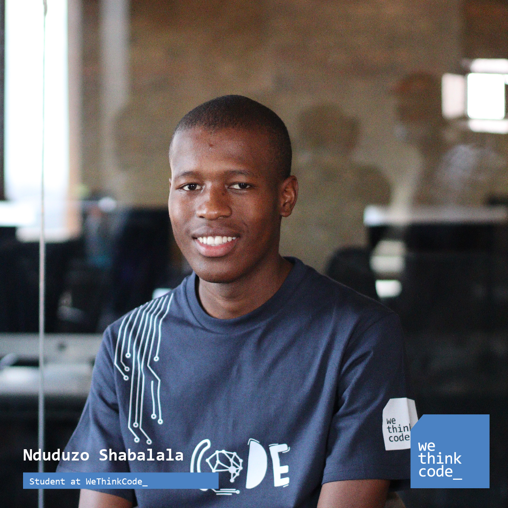

# Hey, I'm Nduduzo Shabalala 👋

### Full-Stack Software Engineer · Vue.js · TypeScript · C#/.NET

I build thoughtful, dependable web products from polished interfaces to scalable APIs and data layers. I have 3+ years of experience shipping SaaS and enterprise software, modernising legacy systems, and turning complex requirements into experiences that feel simple.

&nbsp;&nbsp;
<a href="mailto:ndushabal@gmail.com">Email me</a>

---

## A little about me

- 🧩 I work across the stack, from responsive front ends to APIs, databases, authentication, testing, and deployment.
- 🛠️ My day-to-day strengths are **Vue.js, TypeScript, C#/.NET, SQL**, and CMS-driven product architecture.
- 🚀 I enjoy modernising legacy systems, shaping clean developer workflows, and owning features end to end.
- 🌱 I learn fast, care about the details, and bring a product-minded approach to engineering.

## Featured projects

### QueryCamp

> An interactive learning platform that helps people build practical SQL skills, one query at a time.

QueryCamp turns SQL practice into a guided journey. Learners move through structured lessons, test their knowledge with quizzes, write queries in a focused learning environment, and tackle realistic workplace challenges. A personal dashboard tracks lesson and quiz progress and keeps the next activity easy to find.

**Stack:** TypeScript · Vue.js · C#/.NET · SQL

  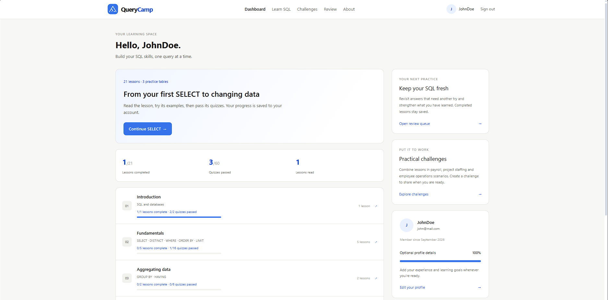
  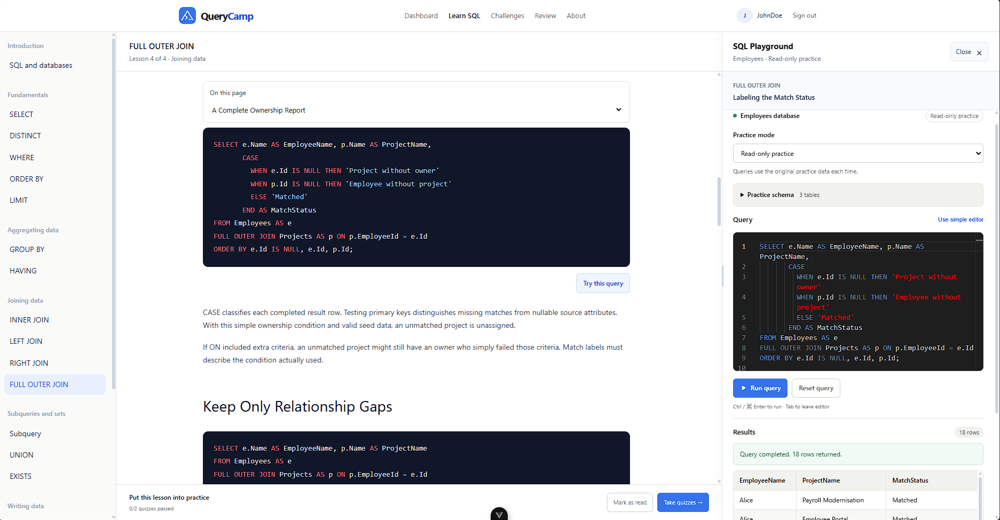

  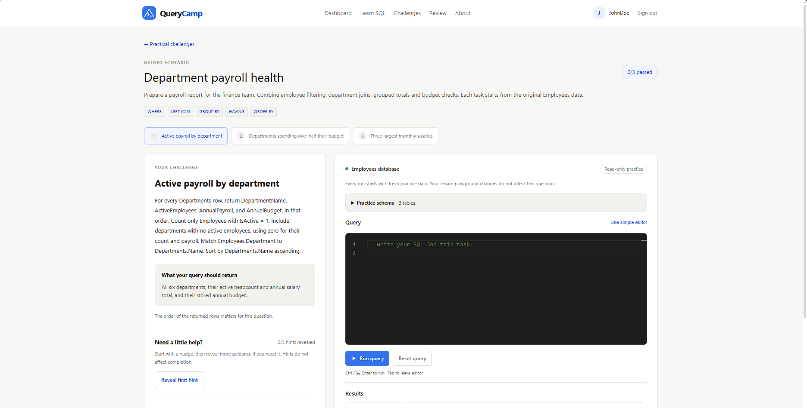
  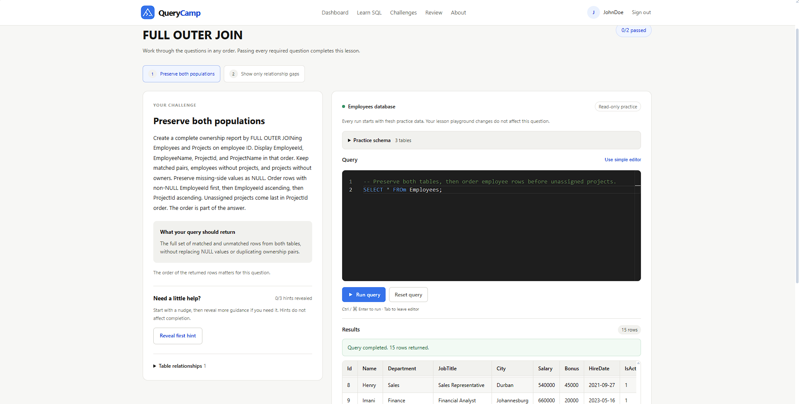

### Blogspace

> A calm, community-driven home for stories, perspectives, and ideas worth sharing.

Blogspace is a full-stack publishing platform where people can discover articles, search for stories and authors, create and edit rich posts, maintain a reading list, and join conversations. It combines a distinctive responsive interface with authenticated content workflows, author profiles, reactions, and persistent data.

**Stack:** Vue.js · TypeScript · CSS3 · C#/.NET · Entity Framework Core · SQL Server

  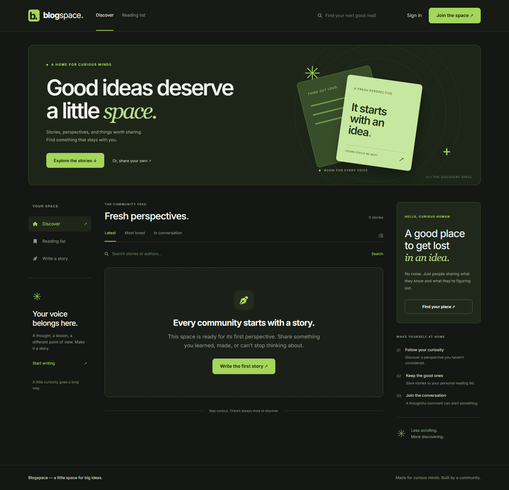
  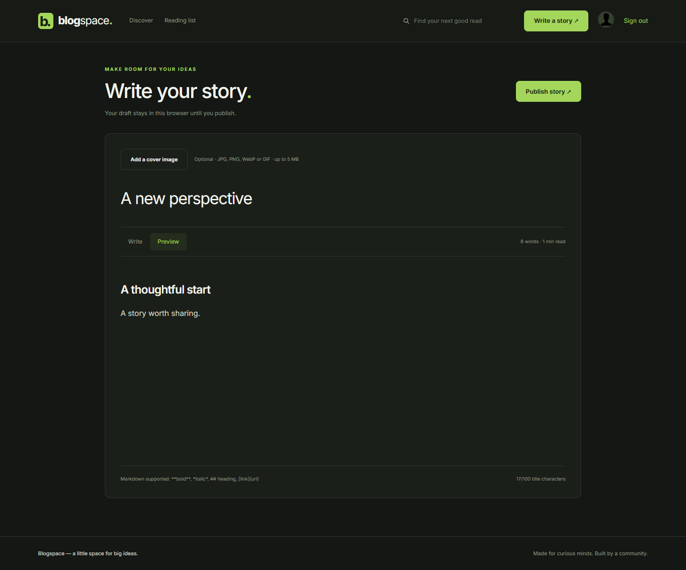

  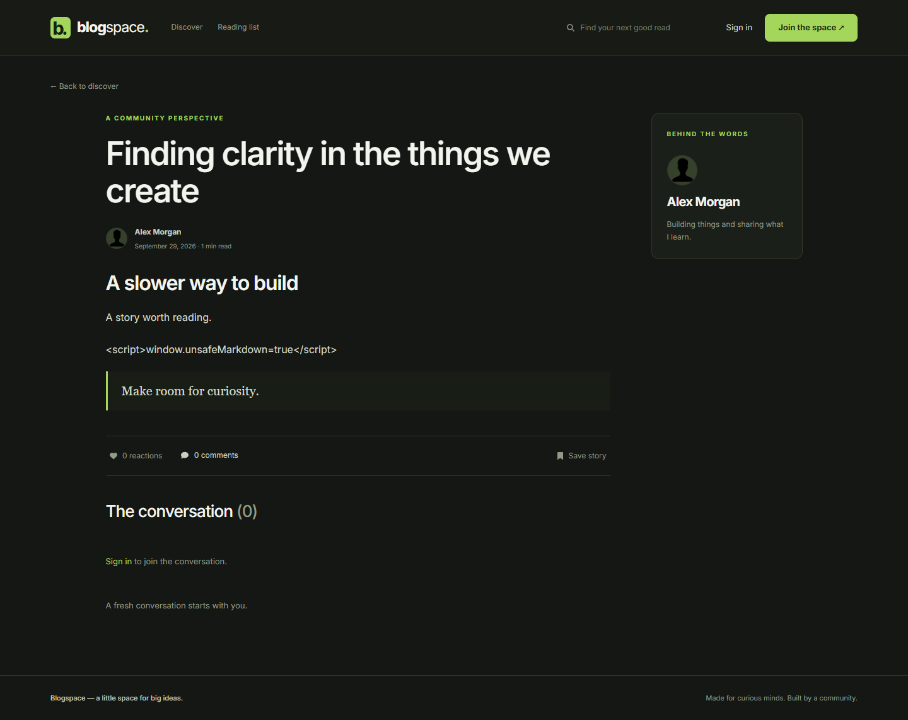
  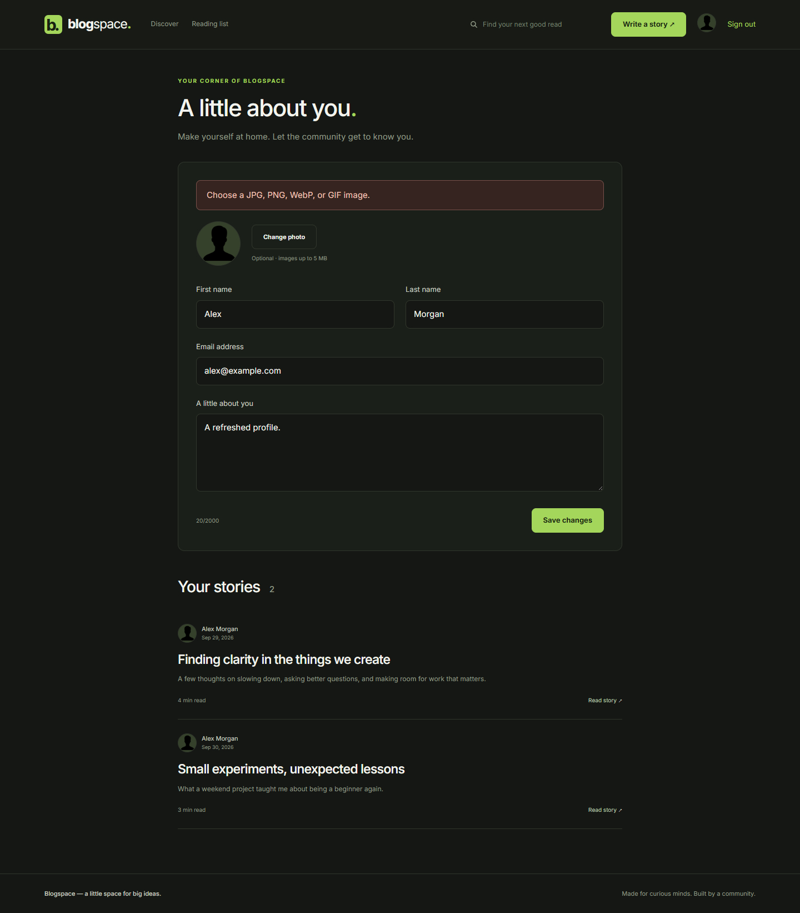

### Orbit

> A social space designed to bring people, ideas, and everyday moments a little closer.

Orbit is a full-stack social platform with account registration, a personalised feed, image posts, likes, comments, sharing, profiles, and direct conversations. Users authenticate into their own space, publish updates, interact with the community, and keep conversations going through the messaging experience.

**Stack:** React · JavaScript · CSS3 · Node.js · Express.js · MongoDB · Firebase

  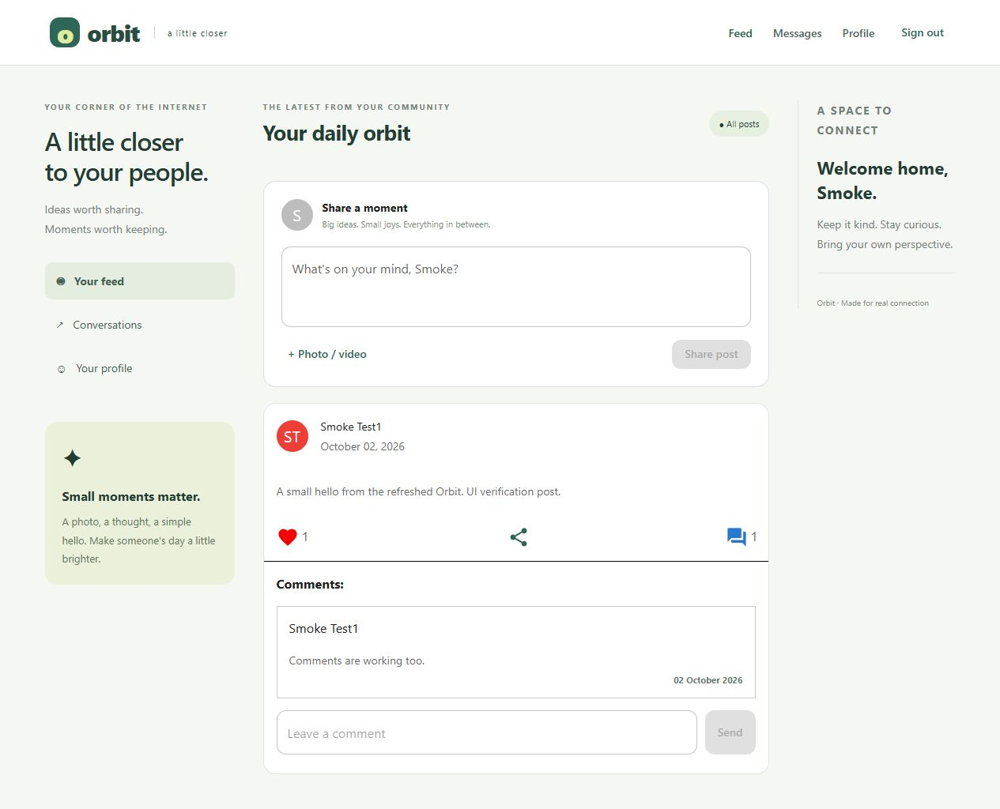
  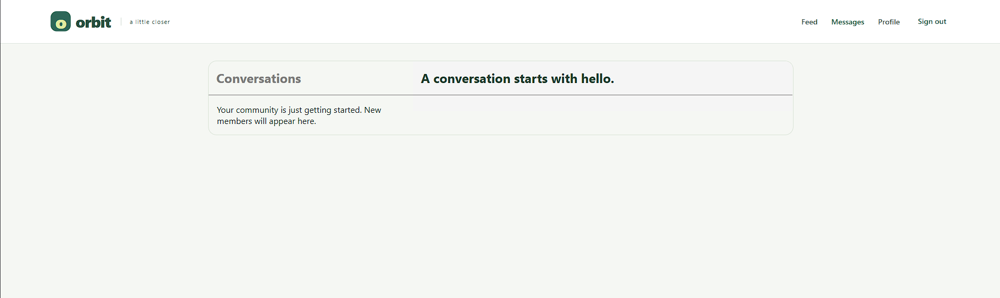

  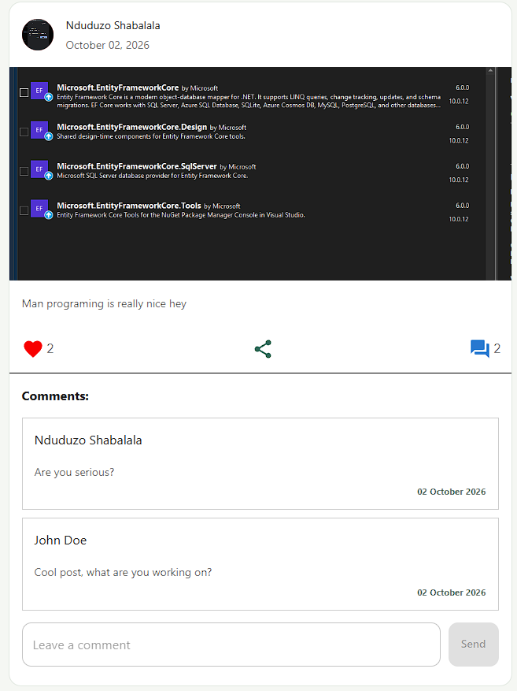
  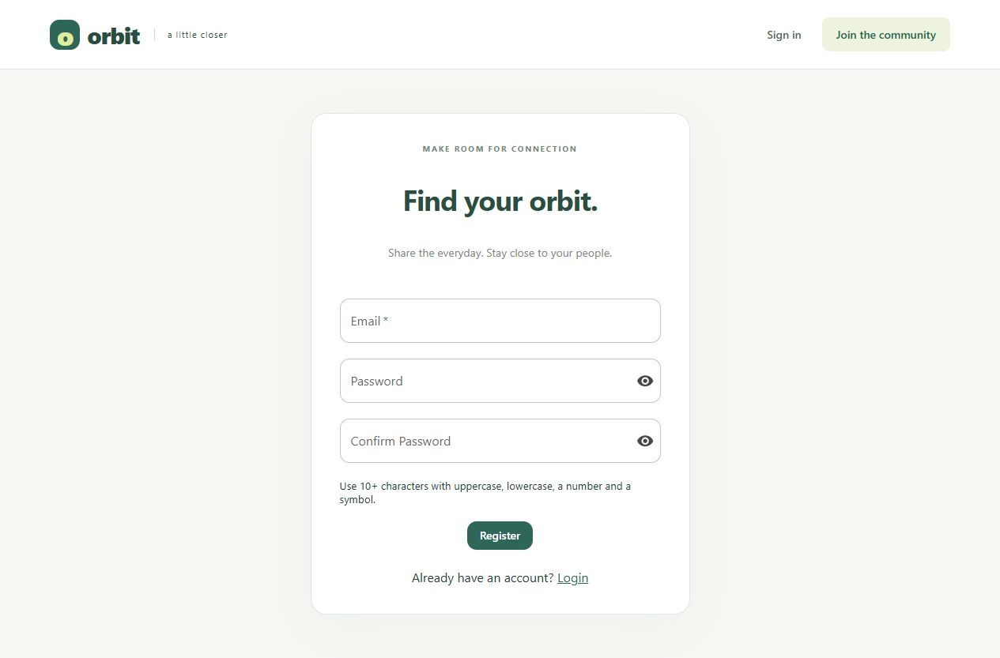

## Toolkit

&nbsp;&nbsp;
&nbsp;&nbsp;
&nbsp;&nbsp;
&nbsp;&nbsp;
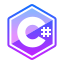&nbsp;&nbsp;
&nbsp;&nbsp;
&nbsp;&nbsp;
&nbsp;&nbsp;
&nbsp;&nbsp;
&nbsp;&nbsp;

**Frontend:** Vue.js, React, TypeScript, JavaScript, Pinia, Redux Toolkit, Tailwind CSS, HTML, CSS, SCSS 
**Backend:** C#, .NET 8/.NET Core, ASP.NET Core, Entity Framework Core, Dapper, Node.js, Express.js, Python, Django, REST and OData APIs 
**Data:** SQL Server, T-SQL, PostgreSQL, MongoDB, Firestore, Elasticsearch, Redis 
**Cloud & delivery:** Azure DevOps, Firebase, Vercel, Docker, GitHub Actions, CI/CD, serverless architecture 
**Ways of working:** Agile/Scrum, xUnit testing, authentication and authorisation, API integrations, data migrations, mentoring

## Experience

### Associate Developer (Contract) · MWR Cybersec
**February 2026 – August 2026 · Hybrid**

- Owned full-stack features across a Vue.js application and a .NET 8 API.
- Designed a large-scale static-content system integrating Umbraco CMS with Pinia, replacing fully preloaded state with lazy, page-level loading.
- Built a developer tool that retrieves Umbraco content through an API proxy and caches it locally as a resilient production fallback.
- Created type-safe CMS key-transformation utilities and built tested ASP.NET Core endpoints with Entity Framework Core, Dapper, SQL Server, and xUnit.
- Helped shape a consistent, maintainable interface using Tailwind CSS.

### Software Engineer · Deel Local Payroll (powered by PaySpace)
**January 2023 – September 2025**

- Delivered full-stack improvements across a large enterprise payroll platform using Vue.js, TypeScript, .NET, Elasticsearch, and Redis.
- Led feature rebuilds that transformed legacy Visual Basic modules into scalable Vue applications backed by new REST and OData APIs.
- Owned complex business logic and production-ready UI work while collaborating with product, QA, and senior engineers in an Agile team.
- Improved platform consistency and reduced reliance on legacy systems through end-to-end modernisation work.

## Education

- **WeThinkCode_** — Two-year intensive software engineering programme focused on Python, C#, and core software engineering principles.
- **Computer Science** — Completed two of three years before moving into practical, project-based software development training.

---

### Let's build something useful.

I'm always happy to connect with developers, product people, and teams solving interesting problems.

<a href="https://www.linkedin.com/in/nduduzo-shabal/">&nbsp; Connect with me on LinkedIn</a>

